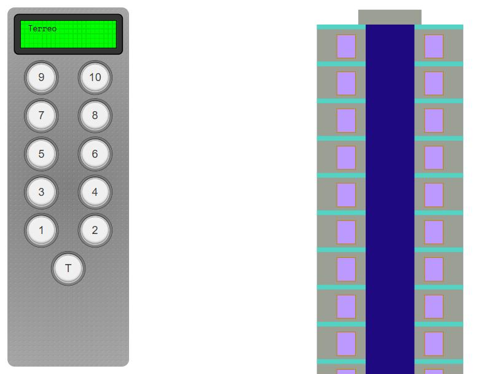

# 🛗 Elevador de 11 paradas

Simulação de um **elevador de 11 paradas** (térreo + 10 andares) feita com **HTML, CSS e JavaScript**. Você aperta os botões do painel e o elevador fecha a porta, se move até cada andar pedido, abre a porta, espera e segue para o próximo.

🔗 **[Ver no CodePen](https://codepen.io/nicole21carvalho/pen/vEYBOBX)**

<p align="center">
  
</p>

## ✨ Funcionalidades

- 🔢 **Painel com 11 botões** que acendem enquanto o andar está na fila
- 🧾 **Fila de destinos** atendida na ordem em que os andares foram pedidos
- 🚪 **Porta animada** que fecha antes de sair e abre ao chegar
- 📟 **Display** com o andar atual e a direção (▲ subindo / ▼ descendo)
- 🔁 Apertar o andar em que o elevador está reabre a porta

## 🧠 Como funciona

O [`script.js`](script.js) é uma **máquina de estados** atualizada a cada quadro com `requestAnimationFrame`:

```
parado → fechando → movendo → abrindo → esperando → fechando → …
```

- **Movimento por tempo, não por quadro:** a velocidade está em pixels por segundo. Assim o elevador anda igual num monitor de 60 Hz ou de 144 Hz.
- **Constantes com nome:** velocidade, tempo de espera e tamanho da porta ficam no topo do arquivo, fáceis de ajustar.

## 🔧 O que foi corrigido

- O código estava todo dentro de um `.zip`: agora os arquivos estão no repositório
- O elevador começava no **décimo andar** em vez do térreo (a linha que deveria posicioná-lo não tinha efeito)
- A velocidade dependia da taxa de quadros do monitor
- Apertar o andar atual fechava a porta e deixava o elevador travado no estado "movendo"
- O display mostrava a direção errada ao se aproximar do andar de destino
- O fundo do painel usava uma sintaxe antiga de `radial-gradient` que os navegadores ignoram
- Texto provisório "Lorem ipsum" no display e página marcada como inglês (`lang="en"`)

## 📁 Estrutura

```
index.html, style.css, script.js   → versão pronta para abrir no navegador
src/index.pug, src/style.scss, src/script.js   → código-fonte do CodePen (Pug e SCSS)
```

## 🛠️ Tecnologias

HTML (Pug) · CSS (SCSS) · JavaScript

## 🚀 Como executar

Baixe o repositório e abra o `index.html` no navegador.
